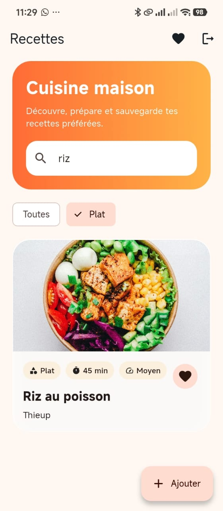
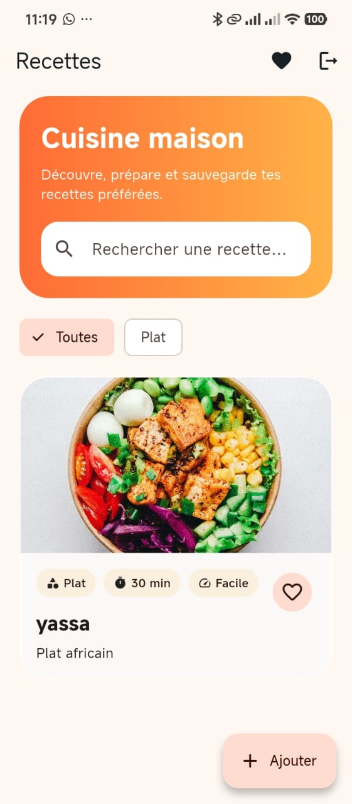
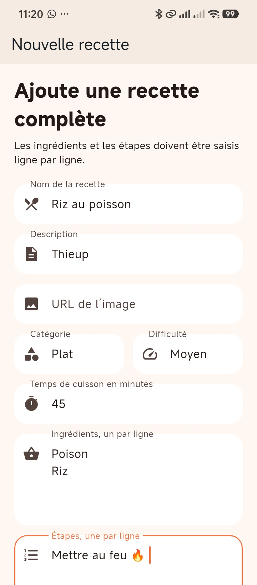

# 🍲 Recipe Clean App — Application Flutter de recettes

Application mobile Flutter développée dans le cadre d’un projet final de développement mobile. Elle permet à un utilisateur de créer un compte, se connecter, consulter une liste de recettes, rechercher des recettes, filtrer par catégorie, ajouter de nouvelles recettes, consulter ses favoris et sauvegarder ses préférences dans Firebase.

Le projet met l’accent sur une architecture propre, une séparation claire des responsabilités, une interface moderne, une intégration Firebase et une base de code présentable dans un contexte académique ou professionnel.

---

## Sommaire

- [Aperçu du projet](#aperçu-du-projet)
- [Captures d’écran](#captures-décran)
- [Fonctionnalités](#fonctionnalités)
- [Stack technique](#stack-technique)
- [Architecture du projet](#architecture-du-projet)
- [Pourquoi cette architecture ?](#pourquoi-cette-architecture-)
- [Modèle de données Firestore](#modèle-de-données-firestore)
- [Règles de sécurité Firestore](#règles-de-sécurité-firestore)
- [Installation locale](#installation-locale)
- [Configuration Firebase](#configuration-firebase)
- [Lancement de l’application](#lancement-de-lapplication)
- [Tests](#tests)
- [Gestion des erreurs](#gestion-des-erreurs)
- [Bonnes pratiques appliquées](#bonnes-pratiques-appliquées)
- [Problèmes fréquents et solutions](#problèmes-fréquents-et-solutions)
- [Améliorations possibles](#améliorations-possibles)
- [Auteur](#auteur)

---

## Aperçu du projet

**Recipe Clean App** est une application de recettes moderne avec authentification et persistance cloud. L’utilisateur peut créer un compte, se connecter, parcourir les recettes disponibles, chercher une recette, filtrer les recettes par catégorie, ajouter une recette complète et marquer des recettes comme favorites.

L’objectif n’est pas seulement d’avoir une application qui fonctionne, mais d’avoir une base de code propre, maintenable et défendable devant un correcteur ou un jury.

---

## Captures d’écran

### Inscription


L’écran d’inscription permet à l’utilisateur de créer un compte avec son nom complet, son email, son mot de passe et la confirmation du mot de passe.

---

### Connexion


L’écran de connexion permet à un utilisateur existant d’accéder à son espace personnel et de retrouver ses recettes favorites.

---

### Tableau de bord des recettes



Le tableau de bord affiche les recettes disponibles, une barre de recherche, des filtres par catégorie et un bouton d’ajout de recette.

---

### Favoris



L’utilisateur peut sauvegarder une recette dans ses favoris. Les favoris sont liés à l’utilisateur connecté.

---

### Création d’une recette



L’écran de création permet d’ajouter une recette complète avec nom, description, image, catégorie, difficulté, temps de cuisson, ingrédients et étapes.

---

## Fonctionnalités

### Authentification

- Création de compte avec Firebase Authentication.
- Connexion avec email et mot de passe.
- Déconnexion sécurisée.
- Redirection automatique selon l’état de connexion.
- Gestion des erreurs d’authentification.

### Gestion des recettes

- Consultation de la liste des recettes depuis Firestore.
- Recherche par mot-clé.
- Filtrage par catégorie.
- Affichage des informations principales : nom, description, catégorie, durée et difficulté.
- Création de nouvelles recettes depuis l’application.
- Sauvegarde des recettes dans Cloud Firestore.

### Favoris

- Ajout d’une recette aux favoris.
- Retrait d’une recette des favoris.
- Favoris séparés par utilisateur.
- Stockage dans Firestore dans une sous-collection liée à l’utilisateur.

### Expérience utilisateur

- Interface moderne avec cartes arrondies.
- Design clair et lisible.
- États de chargement.
- États d’erreur.
- État vide lorsque la liste ne contient aucune donnée.
- Navigation simple et cohérente.

---

## Stack technique

| Technologie | Rôle |
|---|---|
| Flutter | Framework mobile cross-platform |
| Dart | Langage principal |
| Firebase Auth | Authentification utilisateur |
| Cloud Firestore | Base de données cloud NoSQL |
| Riverpod | Gestion d’état |
| GoRouter | Navigation déclarative |
| Material Design | Interface utilisateur |
| Flutter Test | Tests unitaires et widgets |

---

## Architecture du projet

Le projet utilise une architecture **feature-first** inspirée de la **Clean Architecture**.

```text
lib/
├── main.dart
├── firebase_options.dart
│
├── app/
│   ├── app.dart
│   ├── router.dart
│   └── theme.dart
│
├── core/
│   ├── errors/
│   │   └── app_exception.dart
│   ├── utils/
│   │   └── validators.dart
│   └── widgets/
│       ├── app_button.dart
│       ├── app_text_field.dart
│       ├── empty_state.dart
│       ├── error_view.dart
│       └── loading_view.dart
│
└── features/
    ├── auth/
    │   ├── data/
    │   │   └── auth_repository_impl.dart
    │   ├── domain/
    │   │   ├── entities/
    │   │   │   └── app_user.dart
    │   │   └── repositories/
    │   │       └── auth_repository.dart
    │   └── presentation/
    │       ├── pages/
    │       │   ├── login_page.dart
    │       │   └── register_page.dart
    │       └── providers/
    │           └── auth_providers.dart
    │
    └── recipes/
        ├── data/
        │   ├── models/
        │   │   └── recipe_model.dart
        │   └── repositories/
        │       └── recipe_repository_impl.dart
        ├── domain/
        │   ├── entities/
        │   │   └── recipe.dart
        │   └── repositories/
        │       └── recipe_repository.dart
        └── presentation/
            ├── pages/
            │   ├── recipe_list_page.dart
            │   ├── recipe_detail_page.dart
            │   ├── create_recipe_page.dart
            │   └── favorites_page.dart
            └── providers/
                └── recipe_providers.dart
```

---

## Pourquoi cette architecture ?

Cette architecture évite de mélanger la logique métier, l’interface utilisateur et l’accès aux données.

### Couche `domain`

La couche `domain` contient les entités et les contrats métier. Elle ne dépend pas de Firebase, Flutter ou Firestore.

Exemple :

```dart
class Recipe {
  final String id;
  final String name;
  final String description;
  final String imageUrl;
  final String category;
  final String difficulty;
  final int cookingTimeMinutes;
  final List<String> ingredients;
  final List<String> steps;
}
```

Cette couche est stable. Elle représente le cœur métier de l’application.

### Couche `data`

La couche `data` contient les implémentations techniques : Firebase Auth, Firestore, mapping des données et gestion des exceptions.

Elle transforme les documents Firestore en objets métier utilisables par l’application.

### Couche `presentation`

La couche `presentation` contient les pages, widgets et providers. Elle affiche les données et déclenche les actions utilisateur.

Les pages ne doivent pas contenir directement de logique Firestore. Elles passent par les repositories et les providers.

---

## Modèle de données Firestore

### Collection `users`

```text
users/{userId}
```

| Champ | Type | Description |
|---|---|---|
| email | string | Email de l’utilisateur |
| displayName | string | Nom complet |
| createdAt | timestamp | Date de création |

### Collection `recipes`

```text
recipes/{recipeId}
```

| Champ | Type | Description |
|---|---|---|
| name | string | Nom de la recette |
| description | string | Description courte |
| imageUrl | string | URL de l’image |
| category | string | Catégorie de la recette |
| difficulty | string | Niveau de difficulté |
| cookingTimeMinutes | number | Temps de cuisson en minutes |
| ingredients | array<string> | Liste des ingrédients |
| steps | array<string> | Étapes de préparation |
| createdAt | timestamp | Date de création |
| createdBy | string | Identifiant de l’utilisateur créateur |

### Sous-collection des favoris

```text
favorites/{userId}/recipes/{recipeId}
```

| Champ | Type | Description |
|---|---|---|
| recipeId | string | Identifiant de la recette |
| savedAt | timestamp | Date d’ajout aux favoris |

Cette structure permet de séparer les favoris par utilisateur. C’est plus propre que de stocker une liste de favoris directement dans le document utilisateur.

---

## Règles de sécurité Firestore

Pour un projet académique, ces règles sont suffisantes pour protéger les données utilisateur tout en permettant la lecture et l’écriture des recettes par les utilisateurs connectés.

```js
rules_version = '2';

service cloud.firestore {
  match /databases/{database}/documents {

    match /recipes/{recipeId} {
      allow read: if request.auth != null;
      allow create: if request.auth != null;
      allow update, delete: if request.auth != null
        && request.resource.data.createdBy == request.auth.uid;
    }

    match /users/{userId} {
      allow read, write: if request.auth != null
        && request.auth.uid == userId;
    }

    match /favorites/{userId}/recipes/{recipeId} {
      allow read, write, delete: if request.auth != null
        && request.auth.uid == userId;
    }
  }
}
```

> Pour une application en production, il faudrait renforcer davantage les règles de validation des champs, limiter les écritures et prévoir des rôles administrateurs.

---

## Installation locale

### Prérequis

- Flutter SDK installé.
- Dart installé avec Flutter.
- Android Studio ou Android SDK installé.
- Un téléphone Android ou un émulateur.
- Un projet Firebase.
- Firebase CLI installée.
- FlutterFire CLI installée.

### Vérifier l’installation Flutter

```bash
flutter doctor
```

### Installer les dépendances

```bash
flutter pub get
```

---

## Configuration Firebase

### Installer Firebase CLI

```bash
npm install -g firebase-tools
firebase login
firebase projects:list
```

### Installer FlutterFire CLI

```bash
dart pub global activate flutterfire_cli
```

Si la commande `flutterfire` n’est pas reconnue, ajouter le dossier suivant au `PATH` :

```bash
export PATH="$PATH":"$HOME/.pub-cache/bin"
```

Avec Fish shell :

```fish
set -Ux PATH $PATH $HOME/.pub-cache/bin
```

### Configurer Firebase pour le projet

```bash
flutterfire configure --project=login-d11f5 --platforms=android,web
```

Cette commande génère le fichier :

```text
lib/firebase_options.dart
```

Et configure l’application Android avec :

```text
android/app/google-services.json
```

---

## Lancement de l’application

### Lancer sur Android

```bash
flutter run -d <DEVICE_ID>
```

Exemple :

```bash
flutter run -d KZ4TMZXWT8JV4979
```

### Lancer sur Chrome

```bash
flutter run -d chrome
```

### Nettoyer puis relancer

```bash
flutter clean
flutter pub get
flutter run
```

---

## Tests

Lancer tous les tests :

```bash
flutter test
```

Les tests peuvent couvrir :

- La validation d’email.
- La validation du mot de passe.
- Le mapping des modèles Firestore.
- La logique de recherche.
- La logique de filtrage.
- Les cas d’erreurs critiques.

Exemple de test attendu :

```dart
void main() {
  test('should validate correct email', () {
    expect(Validators.isValidEmail('user@gmail.com'), true);
  });

  test('should reject invalid email', () {
    expect(Validators.isValidEmail('usergmail.com'), false);
  });
}
```

---

## Gestion des erreurs

L’application doit afficher des messages compréhensibles pour l’utilisateur.

### Exemples d’erreurs gérées

| Erreur technique | Message utilisateur conseillé |
|---|---|
| `invalid-email` | Adresse email invalide |
| `email-already-in-use` | Cet email est déjà utilisé |
| `weak-password` | Mot de passe trop faible |
| `wrong-password` | Email ou mot de passe incorrect |
| `permission-denied` | Accès refusé par Firestore |
| `network-request-failed` | Problème de connexion Internet |

La bonne pratique consiste à ne jamais afficher directement une erreur technique brute à l’utilisateur final.

---

## Bonnes pratiques appliquées

### Code propre

- Séparation des responsabilités.
- Widgets réutilisables.
- Fonctions courtes et lisibles.
- Nommage clair des classes et fichiers.
- Utilisation de `const` lorsque possible.

### Architecture

- Architecture par fonctionnalité.
- Couche `domain` indépendante.
- Couche `data` responsable de Firebase.
- Couche `presentation` responsable de l’interface.
- Repositories abstraits pour faciliter les tests.

### Performance

- Utilisation de `StreamProvider` pour écouter Firestore.
- Limitation du rebuild grâce à Riverpod.
- Images chargées depuis des URLs.
- États `loading`, `error` et `empty` séparés.

### Sécurité

- Authentification obligatoire pour lire les recettes.
- Chaque utilisateur ne peut accéder qu’à ses favoris.
- Les données utilisateur sont protégées par `request.auth.uid`.

---

## Problèmes fréquents et solutions

### `flutterfire: command not found`

Installer FlutterFire CLI :

```bash
dart pub global activate flutterfire_cli
```

Ajouter au PATH :

```fish
set -Ux PATH $PATH $HOME/.pub-cache/bin
```

---

### `[cloud_firestore/permission-denied]`

Cela signifie que les règles Firestore refusent l’opération.

Solution : vérifier les règles dans Firebase Console :

```text
Firebase Console → Firestore Database → Rules
```

---

### `INSTALL_FAILED_USER_RESTRICTED`

Le téléphone refuse l’installation via USB.

Sur Xiaomi / Redmi / POCO :

```text
Paramètres → Options développeur
```

Activer :

```text
Débogage USB
Installer via USB
Débogage USB paramètres de sécurité
```

---

### `Aucun espace disponible sur le périphérique`

Le disque est plein.

Nettoyer :

```bash
rm -rf ~/.gradle/caches ~/.gradle/daemon
rm -rf build android/build android/app/build
flutter clean
```

Vérifier l’espace disque :

```bash
df -h
```

---

### `ClassNotFoundException MainActivity`

Le package Android est incohérent.

Vérifier :

```text
android/app/build.gradle.kts
```

Il faut avoir :

```kotlin
namespace = "com.jeeridev.recipecleanapp"
applicationId = "com.jeeridev.recipecleanapp"
```

Et le fichier Kotlin :

```text
android/app/src/main/kotlin/com/jeeridev/recipecleanapp/MainActivity.kt
```

Avec :

```kotlin
package com.jeeridev.recipecleanapp

import io.flutter.embedding.android.FlutterActivity

class MainActivity : FlutterActivity()
```

---

## Améliorations possibles

Pour aller plus loin :

- Ajouter une page de détail plus riche.
- Ajouter la modification et suppression des recettes créées par l’utilisateur.
- Ajouter un upload d’image avec Firebase Storage.
- Ajouter une pagination Firestore.
- Ajouter un mode hors-ligne avec cache local.
- Ajouter des tests de widgets.
- Ajouter une intégration continue GitHub Actions.
- Ajouter une traduction française/anglaise.
- Ajouter un mode sombre.

---

## Auteur

Projet réalisé par **Abdourahamane DIALLO**.

Objectif : démontrer la maîtrise du développement mobile Flutter avec Firebase, architecture propre, gestion d’état, persistance cloud, tests et bonnes pratiques de développement.

---

## Conclusion

Ce projet montre une application Flutter complète et structurée. Il ne se limite pas à une simple interface : il intègre une vraie authentification, une base de données cloud, des favoris par utilisateur, une création de recettes, une gestion d’erreurs et une architecture maintenable.

Cette base peut être présentée comme un projet académique solide et peut aussi évoluer vers une application réelle avec quelques améliorations supplémentaires.
